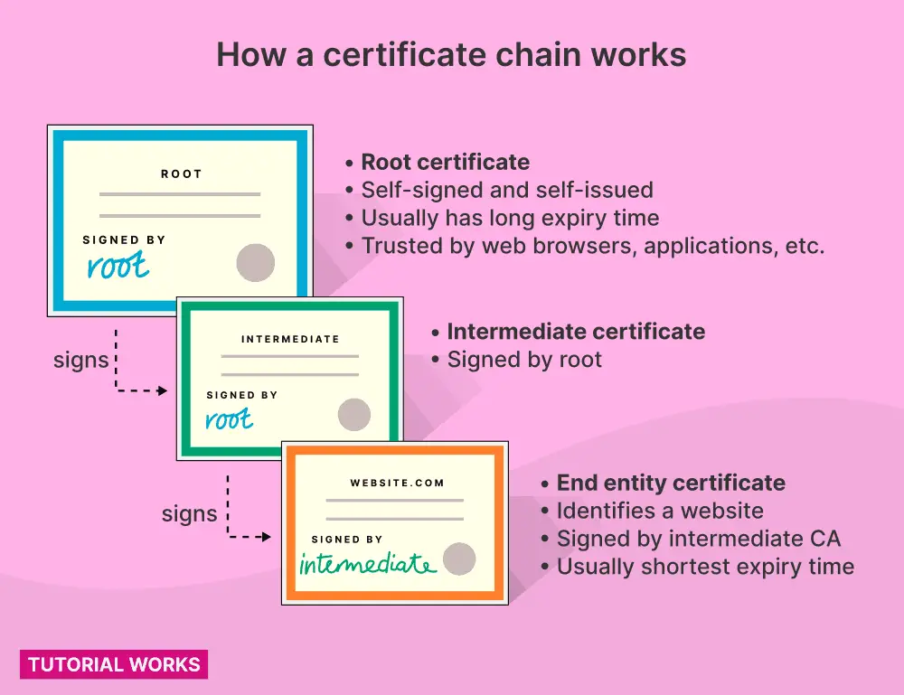
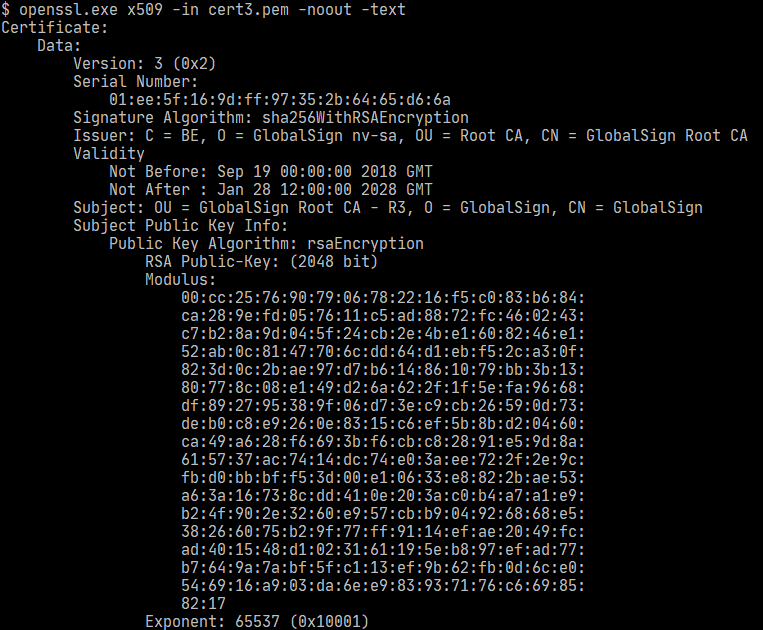

# Java中如何信任SSL证书

> 原文: [https://www.tutorialworks.com/java-trust-ssl/](https://www.tutorialworks.com/java-trust-ssl/)

## 为什么Java应用无法访问HTTPS网站

Java应用无法访问HTTPS(TLS/SSL)网站，可能是我们不信任该网站的证书。
这种情况出现后，我们会看到类似如下的错误：

- "sun.security.validator.ValidatorException: PKIX path building failed"
- "SSLHandshakeException: "unable to find valid certification path to requested target"

其实修复这个问题我们甚至不需要修改一行代码。

我们需要做的是把网站的证书，或者根证书，加入Java的可信证书清单。

### Java信任证书清单

Java应用默认情况下打包了一批可信任的根证书(如同浏览器所做的那样)

根证书通常用来给其他证书签名

下图展示了证书之间如何组成信任链。信任最顶层的根证书，间接完成对信任链中各层证书的信任。



Java存储信任证书清单的文件叫做 truststore

#### 受信任的公共根证书

互联网上大部分网站使用的证书都是被 `truststore` 中的证书签名的。

如果你访问一个使用自签名的证书，或使用不被信任的 `CA(certificate authority)` 签发的证书搭建的网站，Java会抛出上面所提到的异常中的一个并终止运行。

这种情况重点发生在访问组织内部的应用，这些应用通常使用不被信任的 `CA` 签发的证书

为解决这个问题，需要让Java信任这个证书。将证书加到Java的 `truststore`即可。

### 如何信任新证书

通常遵循如下步骤来让Java应用连接到SSL服务:

1. 获取网站的根证书
2. 将根证书加入Java默认的`truststore`
3. 重启Java应用

```markdown
什么是Java的默认`truststore`？
Java的受信证书清单存储在默认的`truststore`。这个文件通常叫 `cacerts`

当然也可以让Java使用自定义的`truststore`
```

Java允许建立独立的信任仓库并把证书导入进去。但一般我不推荐这种做法，因为没有必要。

通常同一台服务器上的所有应用都需要信任同样一批证书。因此把这些证书导入默认的`truststore`可以让所有的应用都受益，这也是最经济的方式之一。

## 如何获取一个网站的证书

如果你没有一个网站的证书，可以发送一个没有任何业务数据的请求到网站，然后将网站返回的证书保存起来。

- 如果网站使用的证书是自签名的，直接保存即可
- 如果网站使用的证书是由其他组织签发的,需要顺着信任链找到根证书并保存

### 通过 openssl 获取证书

**通过 `openssl` 命令可以与网站建立SSL连接，获取到证书，然后把它们保存起来**

#### 采用openssl获取证书清单

使用 `openssl s_client` 命令，可以在一次SSL请求中拿到所有的证书

下面的命令能将网站的证书链中的证书保存下来

```shell
REMOTE_HOST=www.baidu.com

echo \
    | openssl s_client -showcerts -partial_chain \
    -servername ${REMOTE_HOST} -connect ${REMOTE_HOST}:443 \
    | awk '/BEGIN/,/END/{ if(/BEGIN/){a++}; out="cert"a".pem"; print >out}'
```

这条命令是如何运行的呢？

1. 首先我们使用 `echo` 命令向 openssl 发送一条命令
2. openssl 与 ${REMOTE_HOST} 建立连接发送一个空字符串请求,服务端会返回连接的详细信息(这里面包含证书信息)
3. openssl 命令的输出会通过管道的形式送给文本处理命令`awk`，它把每个证书提取到文件

#### 如何查看证书

一旦运行前面的命令，你会得到几个文件。它们就是证书。证书信任链中有几个证书，你就会得到几个文件。

使用 `openssl x509` 命令可以查看每个证书的详细内容

```shell
openssl x509 -in cert1.pem -noout -text
openssl x509 -in cert2.pem -noout -text
```

它会打印许多有用的信息，比如：

- 证书的有效期
- 证书的主体
- 证书的签发人


#### 识别根证书

我们需要识别并信任根证书。

当你在第3个文件上使用openssl x509命令，会得到如下内容：



这就是根证书，因为

- 它是自签名的(主体和签发人是一样的)
- 有一个较长的有效期

一旦我们信任这个证书，相当于自动信任这个机构签发的其他证书
现在我们拿到了根证书，接下来需要让Java信任这个证书，意味着需要将它加入到`truststore`

## 如何添加证书到Java默认的信任仓库

### Java信任仓库的位置

为了维护方便，我们总是把证书加到Java默认的信任仓库。信任仓库通常命名为`cacerts`，它的位置取决于操作系统

| 操作系统                                                                  | 默认信任仓库的位置  |
|-----------------------------------------------------------------------| ----  |
| General                                                               | $JAVA_HOME/lib/security/cacerts |
| Linux (RHEL and related distros, including the OpenJDK docker image)  | /etc/pki/java/cacerts |
| Linux (Ubuntu)                                                        | /etc/ssl/certs/java/cacerts |
| Mac (with JRE installed only)                                         | $(/usr/libexec/java_home)/lib/security/cacerts |
| Mac (with JDK installed)                                              | $(/usr/libexec/java_home)/jre/lib/security/cacerts |
| Windows                                                               | C:\Program Files (x86)\Java\jre<version>\lib\security\cacerts |


### 把证书加入信任仓库

如下使用 `keytool` 命令添加证书。默认情况下信任仓库的密码是 `changeit`

```shell
keytool -import -alias CHOOSE-AN-ALIAS \
    -file certificate.pem \
    -keystore /path/to/your/truststore
```

### 在RHEL(或其变体)系统中把证书加入信任仓库

如果你使用RHEL, CentOS 或者 Fedora。可以使用命令`update-ca-trust`来更新Java信任仓库。只需要把证书拷贝到指定的位置，然后运行 `update-ca-trust`即可。

### 检查添加成功的证书

现在可以检查信任仓库中是否存在这个证书了。

```shell
keytool -list -keystore /etc/pki/java/cacerts
```

## 常见错误

❌ 在服务器上使用自签名的证书

使用自签名证书是在服务器上搭建https最简单的一种方式。
一旦你重新生成自签名证书，所有访问你的客户端都要更新来信任你新生成的证书。
推荐使用由CA签发的证书。客户端应用都会信任CA签发的证书，而且它们有更长的有效期，在很长一段时间里都不需要更新你的客户端应用。

❌ 不信任签发人的证书

如果访问一个由他人签发证书的网站，不要信任该网站的证书。否则的话，你不得不在服务端生成新的证书后更新你的客户端应用。
相反，推荐你应该信任根证书。当信任了根证书，相当于你信任了所有由它签发的证书

❌ 手工更新信任仓库

在类RHEL或相似发行版的服务器上，推荐使用`update-ca-trust`命令来更新证书。

## 尽情使用证书

让Java应用忽略证书是一个很诱人的选择，但你迟早会后悔这个选择。
即使你现在不后悔，但终将会给其他人带来很多麻烦。
现在知道如何使用openssl和keytool来解决Java证书问题了，可以尽情地玩弄SSL了。
